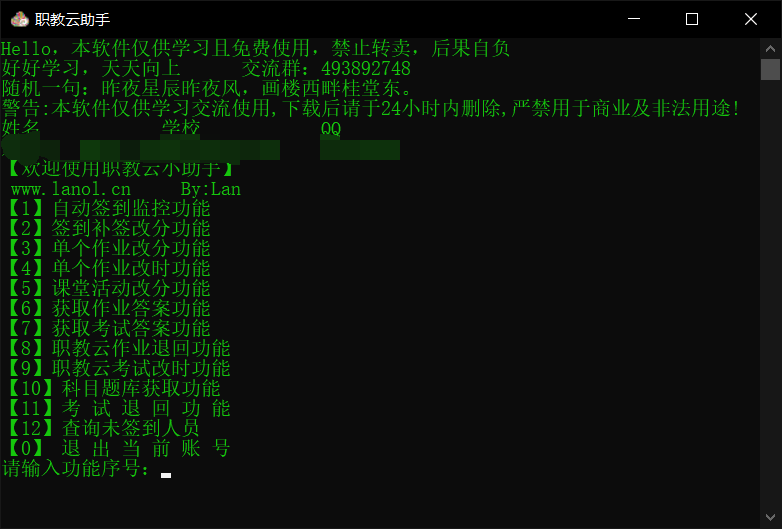
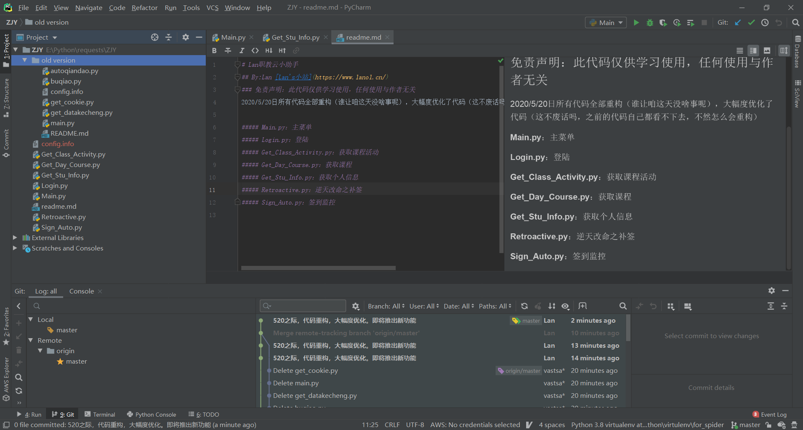
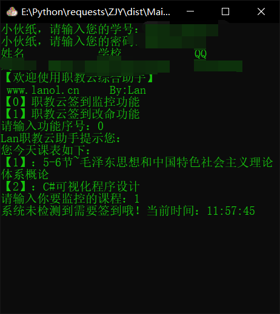
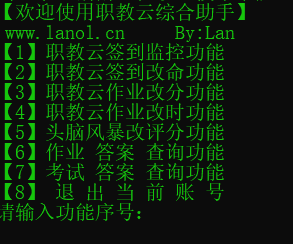
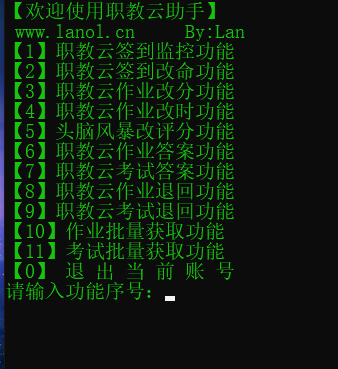

# Lan职教云小助手

## By:Lan [Lan's小站](https://www.lanol.cn/)

### 免责声明：此代码仅供学习使用，任何使用与作者无关

### 2020-5-25 原接口新增newToken
## 2020/5/27最终版更新

1. 课堂活动功能（头脑风暴，讨论，提问）
2. 优化答案显示
3. 考试退回
4. 签到多线程，全自动签到

### 感谢以下老铁的赞助。

| 姓名         | 来源     | 时间      | 金额    |
| ------------ | -------- | --------- | ------- |
| 匿名人士     | 微信赞赏 | 2020-5-21 | ￥2.00  |
| 匿名人士     | 微信赞赏 | 2020-5-22 | ￥4.00  |
| 小张         | 微信赞赏 | 2020-5-22 | ￥6.66  |
| 无敌         | 微信赞赏 | 2020-5-23 | ￥0.01  |
| LWL          | 微信赞赏 | 2020-5-24 | ￥10.00 |
| 成、无视一切 | 微信赞赏 | 2020-5-24 | ￥1.00  |
| ⑧            | 微信赞赏 | 2020-5-24 | ￥20.00 |
| 与风         | 微信赞赏 | 2020-5-24 | ￥5.00  |
| **智         | 支付宝   | 2020-5-24 | ￥2.00  |
| -            | 微信赞赏 | 2020-5-25 | ￥5.00  |
| 璀璨、       | 微信赞赏 | 2020-5-25 | ￥5.00  |
| Lots of      | 微信赞赏 | 2020-5-25 | ￥10.00 |
| **龙         | 支付宝   | 2020-5-25 | ￥30.00 |
| **毅         | 支付宝   | 2020-5-25 | ￥10.00 |

### 目前文件结构：

1. Class_Activity_Grade.py 课堂活动功能文件
2. Config.info 个人信息储存文件
3. Exam_Answer.py 考试答案获取文件
4. Exam_Reject.py 考试退回
5. Exam_Time.py 考试时间
6. Get_All_Answer.py 获取所有答案
7. Get_All_Course.py 获取所有课程
8. Get_Class_Activity.py 获取课堂活动
9. Get_Day_Course.py 获取今日课程
10. Get_Exam_List 获取考试列表
11. Get_Stu_Info.py 获取学生信息
12. Homework_Answer.py 作业答案
13. Homework_Time.py 作业改时
14. Login.py 登陆
15. Main.py 功能菜单
16. No_Sign 未签到人员
17. Re_Grade.py 作业修改分数
18. Readme.md 就是你看到的这个
19. rejectHomework.py 作业退回
20. Retroactive 补签改分
21. Rinse_Answer.py 答案清洗
22. Sign_Auto.py 自动签到
23. Sign_Grade 签到改分

### 功能截图

### 最终感言

职教云这玩意一开始我只做了签到和补签两个功能，然后发在了酷安，N天之后，一位老哥疯狂顶帖，然后看到GitHub也有10多个star了，于是我就更新了一下，然后进度发在了酷安，然后越来越多人提要求，然后我就在不断的造Bug修Bug中，更新到了现在，一开始还想用时间做版本号，然后第一天就超出了好几天。。。然后也有了Repobor和戴芬尔负责了数据的清洗，是答案更加清晰。然后也有人赞助，总而言之感谢你们的支持。毕竟我也不是这个行业的，所以职教云助手也就做着玩玩。以后有缘再见，希望你们能记住这个名字Lan哈哈哈哈。

## 2020/5/20更新

所有代码全部重构（谁让咱这天没啥事呢），大幅度优化了代码（这不废话吗，之前的代码自己都看不下去，不然怎么会重构）

##### Main.py：主菜单

##### Login.py：登陆

##### Get_Class_Activity.py：获取课程活动

##### Get_Day_Course.py：获取课程

##### Get_Stu_Info.py：获取个人信息

##### Retroactive.py：逆天改命之补签

##### Sign_Auto.py：签到监控

2020年5月20日来一张截图纪念一下

## 2020/5/21更新

### 新增修改作业时间，作业分数功能

#### Get_Homework_Grade 获取作业分数

#### Get_Homework_List 获取作业列表

#### Homework_Time 修改作业时间

#### Retroactive 补签

#### Get_All_Course 获取所有课程

#### Re_Grade.py 修改分数

## 2020/5/22更新

1. 新增修改时间反馈
2. 取消分数修改的教师ID
3. 新增注销功能

## 2020/5/23更新

1. 头脑风暴改分功能
2. 考试答案查询功能(答案自动生成在软件目录)
3. 作业答案查询功能
4. 优化获取所有课程代码
5. 修复某些Bug
   欢迎来企鹅群交流：

## 2020/5/24更新和2020/5/25版本

1. 作业退回功能
2. 考试退回功能
3. 修复改分Bug
4. 修复答案获取Bug

## 2020/5/26版本更新

1. 新增题库获取功能
2. 更改答案保存样式
3. 修复判断题
4. 优化代码
5. 修改bug
6. 登陆错误提示
7. 返回首页或上级
8. 感谢这两位老哥的合作支持：
   Repobor，
   戴芬儿，
   清洗了数据，使答案更清晰
   